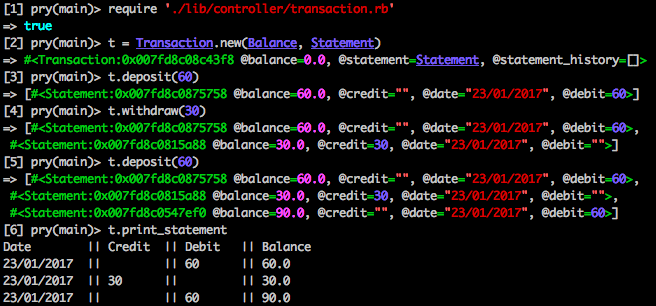

## Bank Tech Test

First practice tech test of Makers Academy Week 10.

Developed over the course of 1 day at MA.

#### Requirements

You should be able to interact with the your code via a REPL like IRB or the JavaScript console. (You don't need to implement a command line interface that takes input from STDIN.)
Deposits, withdrawal.
Account statement (date, amount, balance) printing.
Data can be kept in memory (it doesn't need to be stored to a database or anything).

#### Acceptance criteria

Given a client makes a deposit of 1000 on 10-01-2012 And a deposit of 2000 on 13-01-2012 And a withdrawal of 500 on 14-01-2012 When she prints her bank statement Then she would see

date       || credit || debit   || balance
14/01/2012 ||        || 500.00  || 2500.00
13/01/2012 || 2000.00||         || 3000.00
10/01/2012 || 1000.00||         || 1000.00


#### My Approach:
I first created user stories so that I could develop the functionality once small feature at a time.
Using this, I diagrammed my initial understanding of what classes needed to be made. At first, I decided I needed three classes, one to hold the `Balance`, one for the `Statement` (with the date, amount deposited/withdrawn and balance), and one which controlled everything - `Transaction`. After implementing these features, I decided that I needed to refactor them and split the Transaction responsibilities into other classes - `Statement_View` and `Bank`, which will be the overall controller.

##### To be implemented:
* Continue to refactor and TDD `Transaction` into `Statement_View` and `Bank` controller.
* Clean up statement to include floating point numbers throughout.

#### User Stores

```
As a client,
So that I can know how much money I have available,
I would like to be able to view my balance.
```
```
As a client,
So that I can access my money,
I would like to be able to withdraw an amount.
```
```
As a client,
So that I can add to my balance,
I would like to be able to deposit an amount.
```
```
As a client,
So that I can see what I have deposited and withdrawn,
I would like to be able to see a statement.
```
```
As a client,
So that I can easily read my statement,
I would like my statement to be formatted clearly.
```

### How to Use:
* Clone this repository
* Make sure you are in the root of this directory `cd bank_tech_test`
* Run `gem install bundler`
* Run `bundle install` to ensure you have RSpec installed
* Open up a REPL like `irb` or `pry`
* Run `require './lib/controller/transaction.rb'`
* Create a new Transaction - run `transaction = Transaction.new(Balance, Statement)`
* Deposit `transaction.deposit(<amount>)`
* Withdraw `transcation.withdraw(<amount>)`
* Print Statement `transaction.print_statement`

#### Run the tests:
* Once you have the repository cloned to your local machine and the gems installed, you should be able to run `rspec` in your terminal when in the root of the directory to see the tests.

#### Example:

